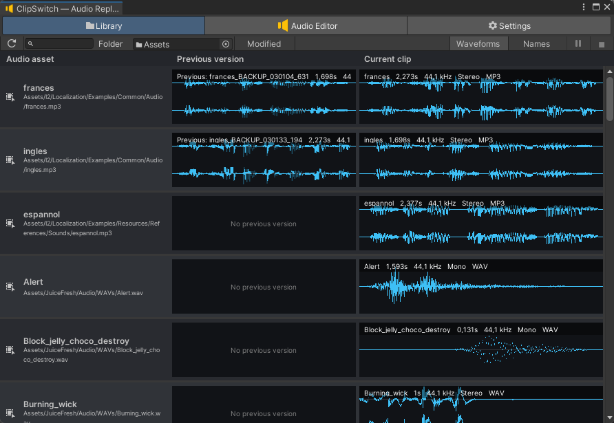
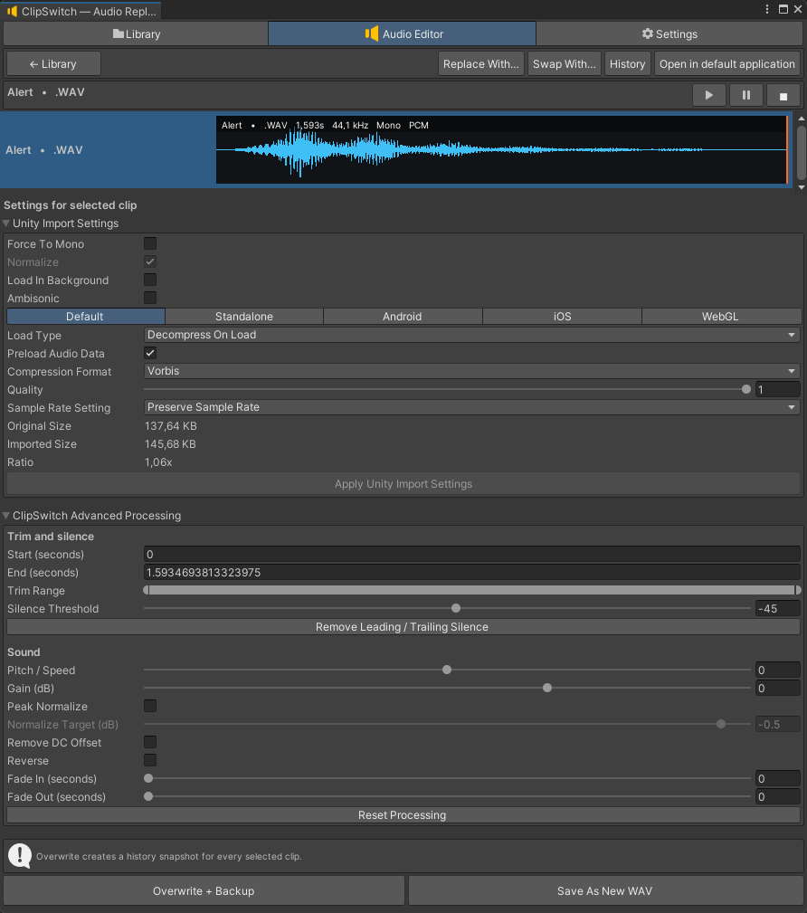

<div align="center">

# ClipSwitch

**A safe audio replacement and editing workflow for Unity Editor.**

Replace, swap, preview, process, and restore `AudioClip` assets without breaking GUIDs or existing project references.


[Features](#features) · [Installation](#installation) · [Quick start](#quick-start) · [Documentation](#documentation) · [Русская версия](#русская-версия)

</div>

## Screenshots

<table>
  <tr>
    <td width="50%">
      
    </td>
    <td width="50%">
      
    </td>
  </tr>
  <tr>
    <td align="center"><strong>Library</strong></td>
    <td align="center"><strong>Audio Editor</strong></td>
  </tr>
</table>

## Overview

ClipSwitch is a Unity Editor extension for managing audio assets in existing projects.

It provides a responsive project audio library, waveform preview, safe replacement and swapping, realtime processing, Unity import settings, reference search, and visual per-clip history.

The main goal is simple: **change the audio without losing the asset identity**.

ClipSwitch preserves the target `.meta` file and GUID, so references from scenes, Prefabs, ScriptableObjects, and components continue to point to the same asset.

## Features

- **Project audio library** with compact and waveform display modes.
- **Deferred loading**: selecting clips does not decode audio until you explicitly open them in the editor.
- **Single and batch replacement** while preserving GUIDs and project references.
- **Audio swapping** for individual clips or ordered clip pairs.
- **Cross-format replacement** through safe `AssetDatabase` moves.
- **Waveform preview and scrubbing** from any position.
- **Realtime processing**:
  - trim;
  - silence removal;
  - DC offset removal;
  - gain;
  - normalization;
  - reverse;
  - fade in and fade out;
  - pitch and speed.
- **Unity import settings** with platform overrides.
- **Visual history** with preview and restoration of earlier versions.
- **Reference search** across loaded scenes and project assets.
- **External editor support** for opening one or several audio files.
- **English and Russian interface**.
- **Offline documentation** included with the package.

## Requirements

- Unity **2022.3 or newer**.
- Unity Editor.
- No runtime dependency is added to player builds.

## Installation

### From a GitHub Release — recommended

1. Open the latest GitHub Release.
2. Download the attached `ClipSwitch.zip` file.
3. Extract the archive.
4. In Unity, open **Window → Package Manager**.
5. Click **+ → Add package from disk…**
6. Select:

```text
com.quartzlab.clipswitch/package.json
```

### From a Git URL

1. Copy the HTTPS URL of this repository.
2. Append the required version tag, for example:

```text
#v1.0.0
```

3. In Unity Package Manager, choose **+ → Add package from git URL…**
4. Paste the complete URL.

Example format:

```text
https://github.com/ACCOUNT/clipswitch.git#v1.0.0
```

## Quick start

1. Open **Tools → QuartzLab → ClipSwitch**.
2. In **Library**, select:
   - one clip with a regular click;
   - a range with `Shift`;
   - individual clips with `Ctrl` on Windows or `Cmd` on macOS.
3. Click **Open in Editor**.
4. Select one or more tracks.
5. Adjust import settings or audio processing.
6. Preview the result.
7. Use **Overwrite + Backup** to write the result safely.

ClipSwitch creates a history snapshot before destructive operations.

## Main workflows

### Replace an AudioClip

Use **Replace With…** from the Library or Audio Editor.

The file contents are replaced while the target asset keeps its identity. When the source format differs, ClipSwitch moves the target asset to the correct extension through `AssetDatabase`.

### Swap AudioClips

Use **Swap With…** to exchange the contents of two clips or several ordered pairs.

The operation creates history snapshots before modifying the files.

### Process audio

Open one or more clips in Audio Editor, select the required tracks, and configure processing.

The preview is recalculated asynchronously and can be checked before overwriting the original asset.

### Restore an earlier version

Open **History** for a single clip.

Each stored version has its own waveform and preview. Restoring an earlier version also snapshots the current state first.

### Find project references

Use **Find References in Project** from the clip context menu.

ClipSwitch separates references found in loaded scene components from referencing project assets.

## Safety model

- Every destructive operation creates a complete file snapshot.
- Backups are stored under `Assets/ClipSwitch Backups` by default.
- The target `.meta` file and GUID are preserved.
- Cross-format changes use `AssetDatabase.MoveAsset`.
- File writes use a temporary file and rollback on failure.
- Compressed clips are temporarily imported as `Decompress On Load` when PCM access is required.
- Original importer settings are restored after reading.
- Closing a picker or pressing **Cancel** never starts a pending operation.

Version control is still recommended before large batch operations.

## Supported formats

ClipSwitch accepts audio formats supported by Unity 2022.3, including:

`WAV` · `MP3` · `OGG` · `FLAC` · `AIFF` · `XM` · `MOD` · `IT` · `S3M`

Advanced processing is available when Unity can decode the selected `AudioClip` to PCM.

Processed compressed audio may be saved as WAV because Unity does not expose a public compressed-audio encoder.

## Documentation

Offline documentation is included in:

```text
Documentation~/index.html
```

It can also be opened from ClipSwitch settings.

Additional files:

- [Changelog](CHANGELOG.md)
- [License](LICENSE.md)

## Limitations

- ClipSwitch works in Unity Editor only.
- Preview and waveform functionality may depend on internal Unity Editor APIs.
- After upgrading Unity, verify audio preview and waveform behavior before production use.
- Advanced processing depends on Unity being able to decode the clip to PCM.

## Reporting issues

When reporting a problem, include:

- Unity version;
- operating system;
- ClipSwitch version;
- source and target audio formats;
- Console error and stack trace;
- reproducible steps.

Do not attach proprietary project files unless they are safe to share.

## License

ClipSwitch is distributed under the [MIT License](LICENSE.md).

---

<details id="русская-версия">
<summary><strong>Русская версия</strong></summary>

## Обзор

ClipSwitch — расширение Unity Editor для работы со звуковыми ассетами существующего проекта.

Оно объединяет библиотеку звуков, waveform-предпросмотр, безопасную замену и обмен файлов, обработку звука, настройки импорта Unity, поиск ссылок и визуальную историю версий.

Главная задача ClipSwitch — **изменить звук, не потеряв идентичность ассета**.

Плагин сохраняет `.meta` и GUID целевого файла, поэтому ссылки из сцен, Prefab, ScriptableObject и компонентов продолжают работать.

## Возможности

- Библиотека звуков проекта с компактным и waveform-режимами.
- Отложенная загрузка: выбор клипов не декодирует звук до команды **Открыть в редакторе**.
- Одиночная и пакетная замена с сохранением GUID и ссылок.
- Обмен содержимым отдельных клипов или нескольких пар.
- Межформатная замена через безопасное перемещение `AssetDatabase`.
- Предпрослушивание и scrubbing waveform с выбранной позиции.
- Обработка:
  - обрезка;
  - удаление тишины;
  - удаление DC offset;
  - gain;
  - нормализация;
  - reverse;
  - fade in и fade out;
  - pitch и speed.
- Настройки импорта Unity и платформенные overrides.
- Визуальная история с предпрослушиванием и восстановлением.
- Поиск ссылок в загруженных сценах и ассетах проекта.
- Открытие одного или нескольких файлов во внешнем приложении.
- Русский и английский интерфейс.
- Офлайн-документация внутри пакета.

## Требования

- Unity **2022.3 или новее**.
- Unity Editor.
- Плагин не добавляет runtime-зависимости в сборку игры.

## Установка

### Из GitHub Release — рекомендуемый способ

1. Открой последний GitHub Release.
2. Скачай прикреплённый файл `ClipSwitch.zip`.
3. Распакуй архив.
4. В Unity открой **Window → Package Manager**.
5. Нажми **+ → Add package from disk…**
6. Выбери:

```text
com.quartzlab.clipswitch/package.json
```

### Через Git URL

1. Скопируй HTTPS-адрес репозитория.
2. Добавь тег нужной версии, например:

```text
#v1.0.0
```

3. В Package Manager выбери **+ → Add package from git URL…**
4. Вставь полный адрес.

Формат:

```text
https://github.com/ACCOUNT/clipswitch.git#v1.0.0
```

## Быстрый старт

1. Открой **Tools → QuartzLab → ClipSwitch**.
2. Во вкладке **Библиотека** выбери:
   - один клип обычным кликом;
   - диапазон через `Shift`;
   - отдельные клипы через `Ctrl` в Windows или `Cmd` в macOS.
3. Нажми **Открыть в редакторе**.
4. Выбери одну или несколько дорожек.
5. Настрой импорт или обработку.
6. Прослушай результат.
7. Используй **Перезаписать + копия** для безопасной записи.

Перед разрушающими операциями ClipSwitch создаёт версию в Истории.

## Безопасность

- Перед каждым изменением создаётся полная копия файла.
- По умолчанию резервные копии находятся в `Assets/ClipSwitch Backups`.
- `.meta` и GUID целевого ассета сохраняются.
- Межформатные изменения выполняются через `AssetDatabase.MoveAsset`.
- Запись идёт через временный файл с откатом при ошибке.
- Для чтения PCM сжатый клип временно переводится в `Decompress On Load`.
- Исходные настройки импорта восстанавливаются после чтения.
- Закрытие окна выбора или **Отмена** не запускают операцию.

Перед массовыми изменениями всё равно рекомендуется сохранить проект в системе контроля версий.

## Поддерживаемые форматы

ClipSwitch принимает форматы, поддерживаемые Unity 2022.3:

`WAV` · `MP3` · `OGG` · `FLAC` · `AIFF` · `XM` · `MOD` · `IT` · `S3M`

Расширенная обработка доступна, когда Unity может декодировать `AudioClip` в PCM.

Обработанный сжатый файл может быть сохранён как WAV, поскольку Unity не предоставляет публичный encoder для сжатых аудиоформатов.

## Документация

Офлайн-документация находится здесь:

```text
Documentation~/index.html
```

Её также можно открыть из настроек ClipSwitch.

Дополнительные файлы:

- [История изменений](CHANGELOG.md)
- [Лицензия](LICENSE.md)

## Ограничения

- ClipSwitch работает только в Unity Editor.
- Предпрослушивание и waveform могут зависеть от внутренних API Unity Editor.
- После обновления Unity проверь воспроизведение и waveform перед использованием в рабочем проекте.
- Обработка зависит от возможности Unity декодировать клип в PCM.

## Сообщения об ошибках

При создании issue укажи:

- версию Unity;
- операционную систему;
- версию ClipSwitch;
- форматы исходного и целевого аудио;
- ошибку и stack trace из Console;
- точные шаги воспроизведения.

Не прикладывай закрытые файлы проекта, если их нельзя публиковать.

## Лицензия

ClipSwitch распространяется по [лицензии MIT](LICENSE.md).

</details>
